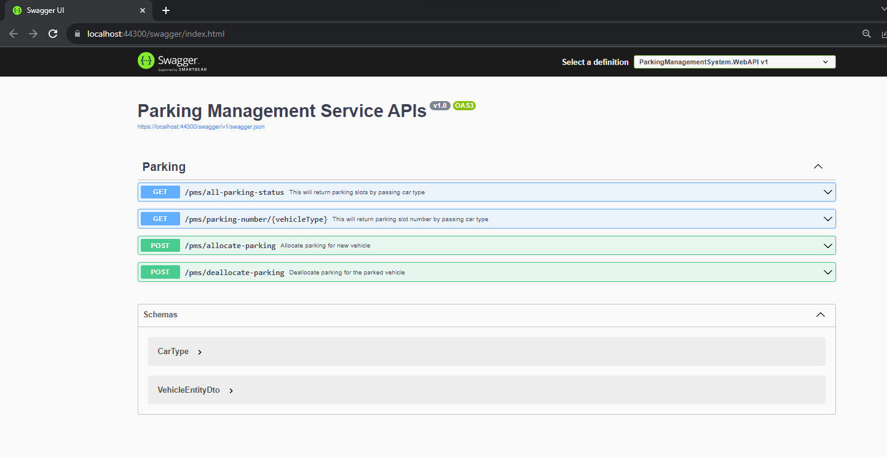

## **Pre-Requisite**

- SQL Server
- Visual Studio 2022 (DotNet 6.0)
- Docker Desktop (To execute docker compose file for service mappings)

**Note**: Kindly provide the valid DB connection string in `appsettings.json`

## **Introduction**

- Design the project management system to allocate the best possible the parking slot in accordance to vehicle type (Hatchback, Sedan/ Compact SUV, SUV or Large cars).

## **Currently system supports**

- Vehicle Type: _Car_
  - _Hatchback, Sedan/Compact SUV, SUV or Large cars_
- Parking Type: Small, Medium, Large
- All parking slots are numbered from 1 to 100 (50 small, 30 Medium and 20 Large)
- Hatchback cars can fit in Small, Medium and Large parking slots
- Sedan/Compact SUV can fit in Medium and Large slots
- SUV or Large cars can fit in Large slot only
- Docker support added for ease of execution
- Added Unit test cases for exposed apis

## **Future Scope**

- The system should be extendable such that new types of slots can be added to accommodate two wheelers and trucks also in future

## **Use Cases**

- User should be able to view current parking space status for all parking slot types.
- User should be able to filter and view parking space status as per vehicle type.
- User should be able to find the best matching slot for the vehicle and then use the un-utilized ones.
- User should be able to allocate the parking space slot for an individual vehicle type.
- User should be able to deallocate the parking space slot for an individual vehicle type.

## **Supported APIs**

